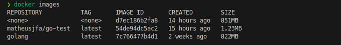

Desafio FullCycle 3.0

Enunciado: 

Esse desafio é muito empolgante principalmente se você nunca trabalhou com a linguagem Go!
Você terá que publicar uma imagem no docker hub. Quando executarmos:

docker run <seu-user>/fullcycle

Temos que ter o seguinte resultado: Full Cycle Rocks!!

Se você perceber, essa imagem apenas realiza um print da mensagem como resultado final, logo, vale a pena dar uma conferida no próprio site da Go Lang para aprender como fazer um "olá mundo".

Lembrando que a Go Lang possui imagens oficiais prontas, vale a pena consultar o Docker Hub.

3) A imagem de nosso projeto Go precisa ter menos de 2MB =)

Dica: No vídeo de introdução sobre o Docker quando falamos sobre o sistema de arquivos em camadas, apresento uma imagem "raiz", talvez seja uma boa utilizá-la.

Suba o projeto em um repositório Git remoto e coloque o link da imagem que subiu no Docker Hub.

Compartilhe o link do repositório do Git remoto para corrigirmos seu projeto.

Divirta-se!

---

# Resolução
A aplicação foi desenvolvida em Go e o Dockerfile foi criado para compilar a aplicação e gerar uma imagem com menos de 2MB.

Para compilar a aplicação e gerar a imagem, execute o comando abaixo:

```bash
docker build --rm -t matheusjfa/go-test .
```

Para executar a imagem, execute o comando abaixo:

```bash
docker run matheusjfa/go-test
```

Segue o link da imagem no Docker Hub: https://hub.docker.com/r/matheusjfa/go-test

Imagens Docker utilizadas:
https://hub.docker.com/_/scratch 
https://hub.docker.com/_/golang

Imagem mostrando o resultado da execução da imagem:


